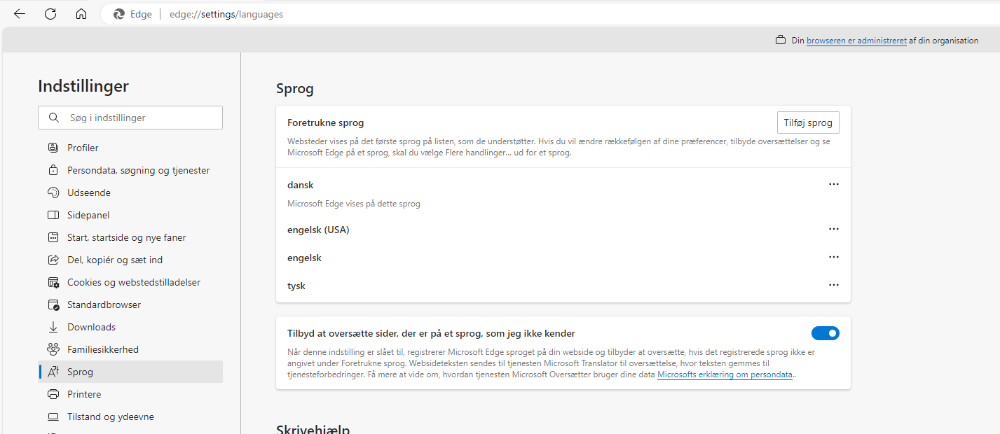

# Tips &amp; Tricks

## Enabling Copy-Paste in Excel with Decimal Separator

The `CopyButton` and the `PasteToDataFrameButton` will determine the `decimal_separator` to use from the *language* settings in your browser. If this setting is not aligned with your Excel application or system, you may encounter difficulties when trying to copy-paste between your data app and Excel.

To resolve this issue, we recommend changing the language of your browser. Alternatively, you can adjust the Excel or System settings.

In the Edge browser, you can modify the `language` by navigating to settings - language. The image below illustrates how it appears when Danish has been selected as the default language.

For other browsers, please refer to their respective documentation.
